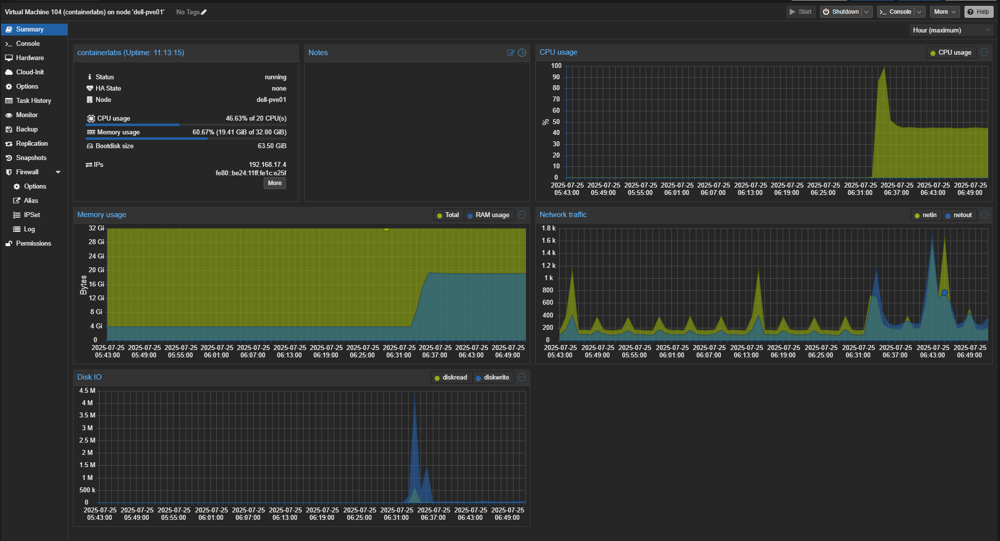
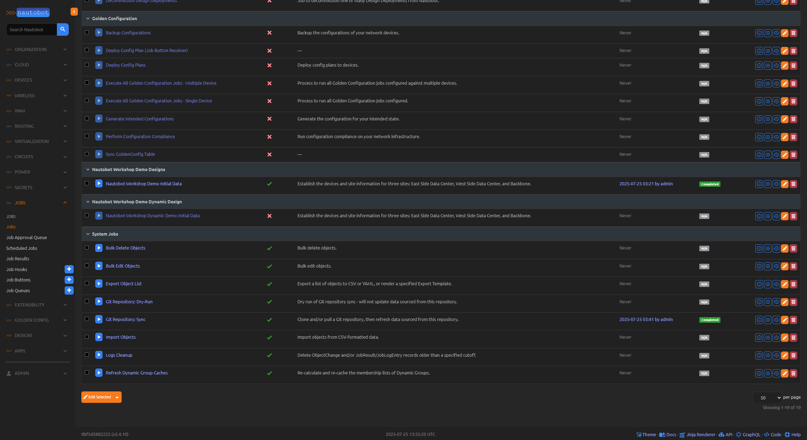
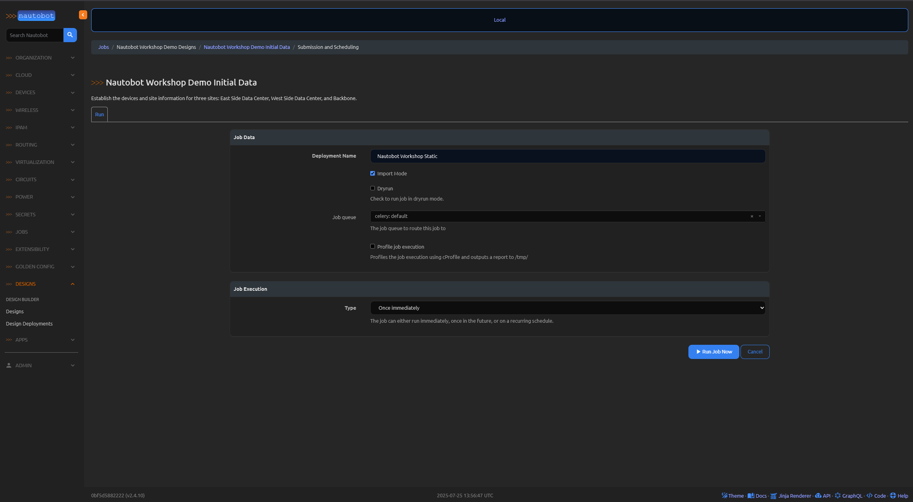
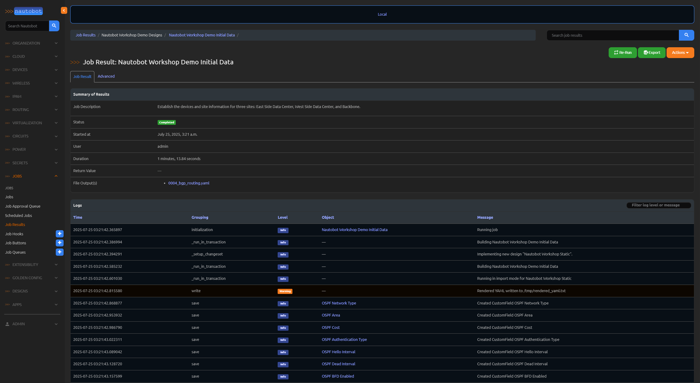

# Nautobot-Workshop
"Nautobot Workshop" is a blog series that guides you through building a fully automated network lab using Nautobot, Containerlab, and Docker. Starting from environment setup on Ubuntu, each post will walk through deploying Nautobot with nautobot-docker-compose, modeling network topologies with Containerlab and vrnetlab-based routers, and populating Nautobot with real device data using Ansible. You'll also learn how to use Nautobot’s GraphQL API for dynamic inventory, generate device configurations with Jinja2 templates, and enforce configuration compliance using the Golden Config plugin. This series is ideal for network engineers looking to integrate source of truth, automation, and lab simulation into a streamlined workflow.

# Blog Posts
I've documented step by step instructions [here](https://blog.byrnbaker.me/posts/Nautobot-Workshop/)
Fork this Repo so you can easily use it on your end.
Blog Series drops starting June 5, 2025

# License
This project is Licensed under Apache License, Version 2.0.

# requirements
- Use poetry version 1.5 as this works with the Nautobot containers. This workshop uses Ubuntu 22.04 or 24.04. I am using Python 3.12, but you can use any version above 3.8 with the Nautobot containers.
- I use Proxmox with a 20vcpu and 32G of ram, when the lab is running this uses about 50% or the CPU and 20G of ram. So you can size your VM accordingly.



# Usage
Start the Nautobot container from under the ```nautobot-docker-compose``` folder run the following commands to setup the environment:

```bash
cd nautobot-docker-compose
cp invoke.example.yml invoke.yml
cp environments/creds.example environments/creds.env 
poetry shell
poetry lock
poetry install
```

Once everything has been installed build the container:

```bash
invoke build
```

After the container has been built you can run it:

```bash
invoke debug
```

Once Nautobot is running you should be able to login to the GUI using admin/admin. I've kept the Ansible tasks for building the data into Nautobot as an example of how to use the various modules. However for labbing purposes it is so much easier to simply use the Nautobot Design Builder for this purpose. You can add everything, remove everything make changes, whatever you need without having to rebuilt the entire container each time.

You will need to enable the Design Builder jobs and then from the Design menu on the right side you can run the Nautobot Workshop Demo Initial Data job. This will fully populate Nautobot so that you can use the Ansible playbook to create the Containerlab topology and spin up the lab.




The task that builds the topology file I am scping files to my containerlab VM and you will want to have a look at this and update it for your use and setup. I use vlan 220 and the subnet 192.168.220.0/24, you might want to use something else. This will need to be changed in the ```nautobot-docker-compose/jobs/initial_design/context/initial_data.ymlnautobot-docker-compose/jobs/initial_design/context/initial_data.yml``` and the ```ansible-lab/roles/build_clab_topology/templates/containerlab_topology.j2``` file as I have it hard coded there.



This will build just the topology file for containerlab.
```bash
ansible-playbook pb.build-lab.yml --vault-password ~/.vault-pass.txt --tags clab
```

This will create all of the configuration files for each of the routers and switches
```bash
ansible-playbook pb.build-lab.yml --vault-password ~/.vault-pass.txt --tags build
```

Before starting the containerlab lab you need to make sure docker has your bridge network
```bash
ubuntu@containerlabs:~/labs$ docker network create   --driver=bridge   --subnet=192.168.220.0/24   --gateway=192.168.220.1   --opt "com.docker.network.bridge.name"="clab-mgmt"   clab-mgmt
```

You can start the lab using this command
```bash
ubuntu@containerlabs:~/labs$ containerlab deploy
13:24:28 INFO Containerlab started version=0.69.1
13:24:28 INFO Parsing & checking topology file=nautobot-workshop-topology.clab.yml
13:24:28 INFO Creating lab directory path=/home/ubuntu/labs/clab-nautobot_workshop
13:24:28 INFO Creating container name=East-Spine01
13:24:28 INFO Creating container name=West-Leaf01
13:24:28 INFO Creating container name=DNS-02
13:24:28 INFO Creating container name=PE3
13:24:28 INFO Creating container name=West-Spine02
13:24:28 INFO Creating container name=P2
13:24:28 INFO Creating container name=DNS-01
13:24:28 INFO Creating container name=West-Spine01
13:24:28 INFO Creating container name=East-Leaf01
13:24:28 INFO Creating container name=West-Leaf02
13:24:28 INFO Creating container name=CE1
13:24:28 INFO Creating container name=PE1
13:24:28 INFO Creating container name=East-Leaf02
13:24:28 INFO Creating container name=P3
13:24:28 INFO Creating container name=CE2
13:24:28 INFO Creating container name=P1
13:24:28 INFO Creating container name=East-Spine02
13:24:28 INFO Creating container name=PE2
13:24:28 INFO Creating container name=RR1
13:24:28 INFO Creating container name=P4
13:24:29 INFO Running postdeploy actions for Arista cEOS 'East-Spine01' node
13:24:30 INFO Running postdeploy actions for Arista cEOS 'DNS-01' node
13:24:30 INFO Running postdeploy actions for Cisco IOL 'P1' node
13:24:30 INFO Created link: CE2:eth1 (Ethernet0/1) ▪┄┄▪ PE3:eth3 (Ethernet0/3)
13:24:30 INFO Created link: CE2:eth2 (Ethernet0/2) ▪┄┄▪ East-Spine01:eth7
13:24:30 INFO Running postdeploy actions for Cisco IOL 'CE2' node
13:24:30 INFO Running postdeploy actions for Cisco IOL 'PE3' node
13:24:30 INFO Running postdeploy actions for Arista cEOS 'DNS-02' node
13:24:30 INFO Created link: DNS-02:eth2 ▪┄┄▪ East-Leaf02:eth5
13:24:30 INFO Created link: P1:eth2 (Ethernet0/2) ▪┄┄▪ P3:eth2 (Ethernet0/2)
13:24:30 INFO Created link: P1:eth1 (Ethernet0/1) ▪┄┄▪ P2:eth1 (Ethernet0/1)
13:24:30 INFO Created link: East-Leaf02:eth1 ▪┄┄▪ East-Spine01:eth2
13:24:30 INFO Running postdeploy actions for Cisco IOL 'P3' node
13:24:30 INFO Running postdeploy actions for Arista cEOS 'East-Leaf02' node
13:24:30 INFO Created link: DNS-02:eth1 ▪┄┄▪ East-Leaf01:eth5
13:24:30 INFO Created link: East-Leaf01:eth1 ▪┄┄▪ East-Spine01:eth1
13:24:31 INFO Created link: P2:eth4 (Ethernet1/0) ▪┄┄▪ PE3:eth1 (Ethernet0/1)
13:24:31 INFO Running postdeploy actions for Cisco IOL 'P2' node
13:24:31 INFO Running postdeploy actions for Cisco IOL 'CE1' node
13:24:31 INFO Created link: DNS-01:eth2 ▪┄┄▪ West-Leaf02:eth5
13:24:31 INFO Created link: East-Leaf01:eth3 ▪┄┄▪ East-Leaf02:eth3
13:24:31 INFO Created link: DNS-01:eth1 ▪┄┄▪ West-Leaf01:eth5
13:24:31 INFO Created link: East-Leaf01:eth4 ▪┄┄▪ East-Leaf02:eth4
13:24:31 INFO Running postdeploy actions for Arista cEOS 'East-Leaf01' node
13:24:31 INFO Created link: CE1:eth2 (Ethernet0/2) ▪┄┄▪ West-Spine01:eth7
13:24:31 INFO Created link: West-Leaf01:eth1 ▪┄┄▪ West-Spine01:eth1
13:24:31 INFO Created link: West-Leaf01:eth3 ▪┄┄▪ West-Leaf02:eth3
13:24:31 INFO Running postdeploy actions for Arista cEOS 'West-Leaf02' node
13:24:31 INFO Created link: West-Leaf01:eth4 ▪┄┄▪ West-Leaf02:eth4
13:24:31 INFO Running postdeploy actions for Arista cEOS 'West-Leaf01' node
13:24:31 INFO Created link: West-Leaf02:eth1 ▪┄┄▪ West-Spine01:eth2
13:24:31 INFO Running postdeploy actions for Arista cEOS 'West-Spine01' node
13:24:31 INFO Created link: CE2:eth3 (Ethernet0/3) ▪┄┄▪ East-Spine02:eth7
13:24:31 INFO Created link: P3:eth4 (Ethernet1/0) ▪┄┄▪ PE2:eth1 (Ethernet0/1)
13:24:31 INFO Created link: East-Leaf01:eth2 ▪┄┄▪ East-Spine02:eth1
13:24:31 INFO Created link: East-Leaf02:eth2 ▪┄┄▪ East-Spine02:eth2
13:24:31 INFO Running postdeploy actions for Arista cEOS 'East-Spine02' node
13:24:31 INFO Running postdeploy actions for Cisco IOL 'PE2' node
13:24:31 INFO Created link: CE1:eth3 (Ethernet0/3) ▪┄┄▪ West-Spine02:eth7
13:24:31 INFO Created link: West-Leaf01:eth2 ▪┄┄▪ West-Spine02:eth1
13:24:31 INFO Created link: West-Leaf02:eth2 ▪┄┄▪ West-Spine02:eth2
13:24:31 INFO Running postdeploy actions for Arista cEOS 'West-Spine02' node
13:24:31 INFO Created link: CE1:eth1 (Ethernet0/1) ▪┄┄▪ PE1:eth3 (Ethernet0/3)
13:24:31 INFO Created link: P1:eth4 (Ethernet1/0) ▪┄┄▪ PE1:eth1 (Ethernet0/1)
13:24:31 INFO Created link: P3:eth3 (Ethernet0/3) ▪┄┄▪ PE1:eth2 (Ethernet0/2)
13:24:31 INFO Running postdeploy actions for Cisco IOL 'PE1' node
13:24:31 INFO Created link: P1:eth3 (Ethernet0/3) ▪┄┄▪ RR1:eth1 (Ethernet0/1)
13:24:32 INFO Created link: P2:eth3 (Ethernet0/3) ▪┄┄▪ RR1:eth2 (Ethernet0/2)
13:24:32 INFO Running postdeploy actions for Cisco IOL 'RR1' node
13:24:32 INFO Created link: P2:eth2 (Ethernet0/2) ▪┄┄▪ P4:eth2 (Ethernet0/2)
13:24:32 INFO Created link: P3:eth1 (Ethernet0/1) ▪┄┄▪ P4:eth1 (Ethernet0/1)
13:24:32 INFO Created link: P4:eth3 (Ethernet0/3) ▪┄┄▪ PE2:eth2 (Ethernet0/2)
13:24:32 INFO Created link: P4:eth4 (Ethernet1/0) ▪┄┄▪ PE3:eth2 (Ethernet0/2)
13:24:32 INFO Running postdeploy actions for Cisco IOL 'P4' node
13:26:31 INFO Adding host entries path=/etc/hosts
13:26:31 INFO Adding SSH config for nodes path=/etc/ssh/ssh_config.d/clab-nautobot_workshop.conf
You are on the latest version (0.69.1)
╭─────────────────────────────────────┬─────────────────────────────┬─────────┬────────────────╮
│                 Name                │          Kind/Image         │  State  │ IPv4/6 Address │
├─────────────────────────────────────┼─────────────────────────────┼─────────┼────────────────┤
│ clab-nautobot_workshop-CE1          │ cisco_iol                   │ running │ 192.168.220.9  │
│                                     │ vrnetlab/cisco_iol:17.12.01 │         │ N/A            │
├─────────────────────────────────────┼─────────────────────────────┼─────────┼────────────────┤
│ clab-nautobot_workshop-CE2          │ cisco_iol                   │ running │ 192.168.220.10 │
│                                     │ vrnetlab/cisco_iol:17.12.01 │         │ N/A            │
├─────────────────────────────────────┼─────────────────────────────┼─────────┼────────────────┤
│ clab-nautobot_workshop-DNS-01       │ ceos                        │ running │ 192.168.220.20 │
│                                     │ ceos:4.34.0F                │         │ N/A            │
├─────────────────────────────────────┼─────────────────────────────┼─────────┼────────────────┤
│ clab-nautobot_workshop-DNS-02       │ ceos                        │ running │ 192.168.220.21 │
│                                     │ ceos:4.34.0F                │         │ N/A            │
├─────────────────────────────────────┼─────────────────────────────┼─────────┼────────────────┤
│ clab-nautobot_workshop-East-Leaf01  │ ceos                        │ running │ 192.168.220.18 │
│                                     │ ceos:4.34.0F                │         │ N/A            │
├─────────────────────────────────────┼─────────────────────────────┼─────────┼────────────────┤
│ clab-nautobot_workshop-East-Leaf02  │ ceos                        │ running │ 192.168.220.19 │
│                                     │ ceos:4.34.0F                │         │ N/A            │
├─────────────────────────────────────┼─────────────────────────────┼─────────┼────────────────┤
│ clab-nautobot_workshop-East-Spine01 │ ceos                        │ running │ 192.168.220.16 │
│                                     │ ceos:4.34.0F                │         │ N/A            │
├─────────────────────────────────────┼─────────────────────────────┼─────────┼────────────────┤
│ clab-nautobot_workshop-East-Spine02 │ ceos                        │ running │ 192.168.220.17 │
│                                     │ ceos:4.34.0F                │         │ N/A            │
├─────────────────────────────────────┼─────────────────────────────┼─────────┼────────────────┤
│ clab-nautobot_workshop-P1           │ cisco_iol                   │ running │ 192.168.220.2  │
│                                     │ vrnetlab/cisco_iol:17.12.01 │         │ N/A            │
├─────────────────────────────────────┼─────────────────────────────┼─────────┼────────────────┤
│ clab-nautobot_workshop-P2           │ cisco_iol                   │ running │ 192.168.220.3  │
│                                     │ vrnetlab/cisco_iol:17.12.01 │         │ N/A            │
├─────────────────────────────────────┼─────────────────────────────┼─────────┼────────────────┤
│ clab-nautobot_workshop-P3           │ cisco_iol                   │ running │ 192.168.220.4  │
│                                     │ vrnetlab/cisco_iol:17.12.01 │         │ N/A            │
├─────────────────────────────────────┼─────────────────────────────┼─────────┼────────────────┤
│ clab-nautobot_workshop-P4           │ cisco_iol                   │ running │ 192.168.220.5  │
│                                     │ vrnetlab/cisco_iol:17.12.01 │         │ N/A            │
├─────────────────────────────────────┼─────────────────────────────┼─────────┼────────────────┤
│ clab-nautobot_workshop-PE1          │ cisco_iol                   │ running │ 192.168.220.6  │
│                                     │ vrnetlab/cisco_iol:17.12.01 │         │ N/A            │
├─────────────────────────────────────┼─────────────────────────────┼─────────┼────────────────┤
│ clab-nautobot_workshop-PE2          │ cisco_iol                   │ running │ 192.168.220.7  │
│                                     │ vrnetlab/cisco_iol:17.12.01 │         │ N/A            │
├─────────────────────────────────────┼─────────────────────────────┼─────────┼────────────────┤
│ clab-nautobot_workshop-PE3          │ cisco_iol                   │ running │ 192.168.220.8  │
│                                     │ vrnetlab/cisco_iol:17.12.01 │         │ N/A            │
├─────────────────────────────────────┼─────────────────────────────┼─────────┼────────────────┤
│ clab-nautobot_workshop-RR1          │ cisco_iol                   │ running │ 192.168.220.11 │
│                                     │ vrnetlab/cisco_iol:17.12.01 │         │ N/A            │
├─────────────────────────────────────┼─────────────────────────────┼─────────┼────────────────┤
│ clab-nautobot_workshop-West-Leaf01  │ ceos                        │ running │ 192.168.220.14 │
│                                     │ ceos:4.34.0F                │         │ N/A            │
├─────────────────────────────────────┼─────────────────────────────┼─────────┼────────────────┤
│ clab-nautobot_workshop-West-Leaf02  │ ceos                        │ running │ 192.168.220.15 │
│                                     │ ceos:4.34.0F                │         │ N/A            │
├─────────────────────────────────────┼─────────────────────────────┼─────────┼────────────────┤
│ clab-nautobot_workshop-West-Spine01 │ ceos                        │ running │ 192.168.220.12 │
│                                     │ ceos:4.34.0F                │         │ N/A            │
├─────────────────────────────────────┼─────────────────────────────┼─────────┼────────────────┤
│ clab-nautobot_workshop-West-Spine02 │ ceos                        │ running │ 192.168.220.13 │
│                                     │ ceos:4.34.0F                │         │ N/A            │
╰─────────────────────────────────────┴─────────────────────────────┴─────────┴────────────────╯
```

Once you lab is up and running you can use this to push the full configurations over to each router and switch
```bash
ansible-playbook pb.build-lab.yml --vault-password ~/.vault-pass.txt --tags deploy
```